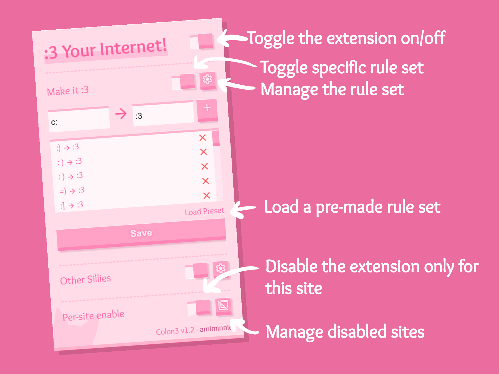

# :3 
Extension that :3 your internet!

# How to install :3?
* Download the [latest release](https://github.com/amiminnie/Colon3/releases/latest) and extract it to a folder on your computer.
* Locate the extensions page on your browser and enable Developer Mode.
* Select `Load unpacked` and select the folder you just extracted.
* If everything was done correctly, you should now see a  in your extensions list!

# How to use it?
When you click on the little , a little window will pop up. The UI is pretty intuitive to use, 
 
You can either add your own rules or load my preset, or both!

# How to uninstall? 3:
* You can visit the same extensions page and press `Remove`
